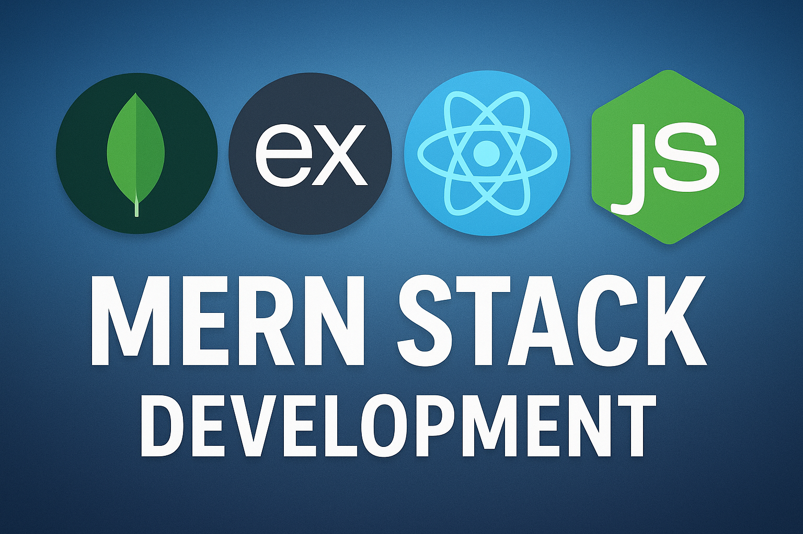

# Portfolio Website Improvement Guide
## Analysis & Recommendations for Waheed Gulzar's Portfolio

---

## Executive Summary

Your portfolio is visually attractive with modern design elements, smooth animations, and good use of a dark theme with gradient accents. However, there are several critical issues affecting functionality, SEO, performance, and user experience that need immediate attention.

---

## 🔴 Critical Issues (High Priority)

### 1. **Duplicate HTML and CSS Closings**
**Issue:** The HTML file has multiple duplicate closing tags at the end (lines 1403-1413)
```html
</body>
</html>
</body>
</html>
  </style>
</body>
</html>
```

**Impact:** 
- Browser rendering errors
- Invalid HTML structure
- Potential JavaScript execution issues

**Fix:**
- Remove all duplicate closing tags
- Ensure single clean closure: `</body></html>`

---

### 2. **Incomplete/Broken Email Functionality**
**Issue:** The contact form uses EmailJS but the implementation appears incomplete
- No visible initialization code shown in the HTML
- CV download links point to `#` (non-functional)
- Form submission handling unclear

**Impact:**
- Contact form likely doesn't send emails
- Users cannot download your CV
- No lead generation capability

**Recommendations:**
```javascript
// Add proper EmailJS initialization
emailjs.init("YOUR_PUBLIC_KEY");

// Implement proper form submission
document.getElementById('contact-form').addEventListener('submit', function(e) {
    e.preventDefault();
    
    emailjs.sendForm('YOUR_SERVICE_ID', 'YOUR_TEMPLATE_ID', this)
        .then(function(response) {
            console.log('SUCCESS', response.status, response.text);
            // Show success message
            showNotification('Message sent successfully!', 'success');
        }, function(error) {
            console.log('FAILED', error);
            showNotification('Failed to send message. Please try again.', 'error');
        });
});

// Fix CV download
document.getElementById('download-cv').href = 'path/to/your/cv.pdf';
document.getElementById('download-cv-mobile').href = 'path/to/your/cv.pdf';
```

---

### 3. **Missing JavaScript File**
**Issue:** The HTML includes inline scripts but critical functionality is missing
- Counter animation logic
- Mobile menu toggle
- Scroll animations
- Form validation

**Impact:**
- Statistics counters don't animate
- Mobile menu may not work properly
- Scroll-triggered animations don't function

**Solution:** Create `script.js` with:
```javascript
// Counter Animation
function animateCounters() {
    const counters = document.querySelectorAll('.counter');
    const speed = 200;
    
    counters.forEach(counter => {
        const target = +counter.getAttribute('data-count');
        const increment = target / speed;
        
        const updateCount = () => {
            const count = +counter.innerText;
            if (count < target) {
                counter.innerText = Math.ceil(count + increment);
                setTimeout(updateCount, 10);
            } else {
                counter.innerText = target;
            }
        };
        updateCount();
    });
}

// Mobile Menu Toggle
const mobileMenuButton = document.getElementById('mobile-menu-button');
const mobileMenu = document.getElementById('mobile-menu');
const menuIcon = document.getElementById('menu-icon');

mobileMenuButton?.addEventListener('click', () => {
    mobileMenu.classList.toggle('hidden');
    menuIcon.classList.toggle('fa-bars');
    menuIcon.classList.toggle('fa-times');
});

// Scroll-based Fade In
const observerOptions = {
    threshold: 0.1,
    rootMargin: '0px 0px -100px 0px'
};

const observer = new IntersectionObserver((entries) => {
    entries.forEach(entry => {
        if (entry.isIntersecting) {
            entry.target.classList.add('visible');
        }
    });
}, observerOptions);

document.querySelectorAll('.fade-in-up').forEach(el => {
    observer.observe(el);
});

// Loading Screen
window.addEventListener('load', () => {
    const loadingScreen = document.getElementById('loading-screen');
    loadingScreen.classList.add('loading-fade-out');
    setTimeout(() => {
        loadingScreen.style.display = 'none';
    }, 500);
});

// Particle Generation
function createParticles() {
    const particlesContainer = document.querySelector('.particles');
    for (let i = 0; i < 50; i++) {
        const particle = document.createElement('div');
        particle.className = 'particle';
        particle.style.left = Math.random() * 100 + '%';
        particle.style.width = Math.random() * 5 + 2 + 'px';
        particle.style.height = particle.style.width;
        particle.style.animationDuration = (Math.random() * 3 + 2) + 's';
        particle.style.animationDelay = Math.random() * 0.5 + 's';
        particlesContainer.appendChild(particle);
    }
}

createParticles();
animateCounters();
```

---

### 4. **Inline Styles Taking Precedence Over CSS**
**Issue:** Extensive Tailwind classes mixed with custom CSS in the HTML
- Hard to maintain
- Difficult to debug
- Performance impact with CDN dependency

**Impact:**
- Larger HTML file size
- Slower page load
- Harder to update styling consistently

---

## 🟡 Major Issues (Medium Priority)

### 5. **SEO Optimization Missing**

**Current Issues:**
- No meta descriptions for key sections
- Missing Open Graph tags
- No structured data (Schema.org)
- Poor heading hierarchy in some sections

**Improvements:**
```html
<head>
    <!-- Better Meta Tags -->
    <meta name="description" content="Full-stack developer specializing in MERN stack, React, Node.js. Building scalable web applications and creating exceptional user experiences.">
    <meta name="keywords" content="web developer, MERN stack, React, Node.js, JavaScript, full-stack developer, Islamabad">
    <meta name="author" content="Waheed Gulzar">
    
    <!-- Open Graph -->
    <meta property="og:title" content="Waheed Gulzar | Full Stack Developer">
    <meta property="og:description" content="Crafting scalable web applications with React, Node.js, and modern technologies">
    <meta property="og:image" content="https://waheed-gulzar.github.io/my-portfolio/og-image.png">
    <meta property="og:url" content="https://waheed-gulzar.github.io/my-portfolio/">
    <meta property="og:type" content="website">
    
    <!-- Twitter Card -->
    <meta name="twitter:card" content="summary_large_image">
    <meta name="twitter:title" content="Waheed Gulzar | Full Stack Developer">
    <meta name="twitter:description" content="Crafting scalable web applications">
    
    <!-- Structured Data -->
    <script type="application/ld+json">
    {
        "@context": "https://schema.org",
        "@type": "Person",
        "name": "Waheed Gulzar",
        "jobTitle": "Full Stack Developer",
        "url": "https://waheed-gulzar.github.io/my-portfolio",
        "sameAs": [
            "https://github.com/Waheed-Gulzar",
            "https://www.linkedin.com/in/waheed-gulzar-6a15a834a/",
            "https://www.instagram.com/waheed_gulzar51"
        ],
        "email": "waheedgulzar29@gmail.com"
    }
    </script>
</head>
```

---

### 6. **Performance Issues**

**Problems:**
- Large unoptimized images (2.1MB - 2.9MB each)
- Multiple CDN dependencies (Tailwind, FontAwesome, GoogleFonts, GSAP, EmailJS)
- No caching strategy
- Render-blocking resources

**Optimizations:**

**a) Image Optimization:**
```bash
# Compress images using ImageMagick or similar
convert mern.png -resize 1200x800 -quality 80 mern-optimized.jpg
```

Expected reductions:
- MERN: 2.7MB → ~300KB
- PyGame: 2.1MB → ~250KB
- n8n: 2.1MB → ~280KB
- DevOps: Use smaller placeholder until lazy-loaded

**b) Lazy Loading Images:**
```html

```

**c) Reduce CDN Dependencies:**
- Consider self-hosting fonts or using system fonts
- Replace GSAP with CSS animations (already using some)
- Use native LazyLoad API instead of external libraries

---

### 7. **Accessibility Issues**

**Missing Features:**
- No alt text on project images
- Poor color contrast in some areas (gray text on dark background)
- Missing ARIA labels
- No skip-to-content link
- Mobile menu lacks proper focus management

**Fixes:**
```html
<!-- Add skip-to-content link -->
<a href="#home" class="skip-to-content">Skip to main content</a>

<!-- Add proper alt text -->


<!-- ARIA labels for interactive elements -->
<button id="mobile-menu-button" 
        aria-label="Toggle mobile navigation menu"
        aria-expanded="false"
        aria-controls="mobile-menu">
    <i class="fas fa-bars"></i>
</button>

<!-- Proper color contrast -->
<!-- Change gray-400 to gray-300 or lighter for better contrast -->
```

---

### 8. **Form Validation Issues**

**Current Problems:**
- No client-side validation
- No error messages
- No loading state feedback

**Implementation:**
```javascript
function validateForm(formData) {
    const errors = {};
    
    if (!formData.firstName.trim()) {
        errors.firstName = 'First name is required';
    }
    if (!formData.lastName.trim()) {
        errors.lastName = 'Last name is required';
    }
    if (!formData.email.match(/^[^\s@]+@[^\s@]+\.[^\s@]+$/)) {
        errors.email = 'Valid email is required';
    }
    if (!formData.message.trim() || formData.message.length < 10) {
        errors.message = 'Message must be at least 10 characters';
    }
    
    return errors;
}

// Show validation feedback
function showFieldError(fieldName, error) {
    const field = document.getElementById(fieldName);
    const errorDiv = field.nextElementSibling;
    if (!errorDiv || !errorDiv.classList.contains('error-message')) {
        const newError = document.createElement('div');
        newError.className = 'error-message text-red-500 text-sm mt-1';
        newError.textContent = error;
        field.after(newError);
    }
}
```

---

### 9. **Incomplete Project Showcase**

**Issues:**
- Only 4 projects shown, but you have more
- Project cards lack detailed descriptions
- No tags/technologies shown per project
- No live demo links (only GitHub links for some)

**Recommendations:**
```html
<!-- Enhanced Project Card -->
<div class="project-card glass-effect rounded-2xl overflow-hidden hover:scale-105 transition-all">
    <div class="relative">
        
        <div class="absolute top-4 right-4 flex gap-2">
            <span class="px-3 py-1 bg-blue-500 text-white text-sm rounded-full">React</span>
            <span class="px-3 py-1 bg-green-500 text-white text-sm rounded-full">Node.js</span>
        </div>
    </div>
    <div class="p-6">
        <h3 class="text-xl font-bold mb-2">Project Name</h3>
        <p class="text-gray-300 mb-4">Detailed project description with key features and technologies used.</p>
        <div class="flex gap-4">
            <a href="https://github.com" class="text-cyan-400 hover:text-cyan-300 transition">
                <i class="fab fa-github mr-2"></i>Source Code
            </a>
            <a href="https://live-demo.com" class="text-cyan-400 hover:text-cyan-300 transition">
                <i class="fas fa-external-link-alt mr-2"></i>Live Demo
            </a>
        </div>
    </div>
</div>
```

---

## 🟢 Minor Issues (Low Priority)

### 10. **Browser Compatibility**

**Issue:** Using modern CSS features that might not work in older browsers
- CSS property with `@property`
- `animation-timing-function: var()`
- `has()` selector

**Solution:** Add fallbacks:
```css
/* Fallback for older browsers */
@supports not (@property --angle) {
    .card-img {
        rotate: 0deg;
    }
}
```

---

### 11. **Mobile Responsiveness Improvements**

**Current Issues:**
- Text sizes jump dramatically on small screens
- Some spacing needs adjustment on tablets
- Project carousel could be better on mobile

**Suggested Improvements:**
```css
/* Better mobile padding */
@media (max-width: 768px) {
    section {
        padding: 3rem 1rem;
    }
    
    h1 {
        font-size: 2rem;
    }
    
    h2 {
        font-size: 1.5rem;
    }
    
    .grid {
        grid-template-columns: 1fr;
    }
}
```

---

### 12. **Code Organization**

**Current Structure:**
```
my-portfolio/
├── index.html (1405 lines - monolithic)
├── styles.css (isolated, good)
├── images/
└── README.md (missing)
```

**Recommended Structure:**
```
my-portfolio/
├── index.html (kept lean)
├── src/
│   ├── css/
│   │   ├── styles.css
│   │   ├── animations.css
│   │   ├── responsive.css
│   │   └── accessibility.css
│   ├── js/
│   │   ├── main.js
│   │   ├── email.js
│   │   ├── animations.js
│   │   └── utils.js
│   └── images/ (optimized)
├── assets/
│   ├── resume.pdf
│   ├── og-image.png
│   └── favicon.svg
├── README.md
├── .gitignore
└── package.json (if using build tools)
```

---

### 13. **Missing Documentation**

**Add to Repository:**
```markdown
# Waheed Gulzar's Portfolio

## 📋 Overview
Full-stack developer portfolio showcasing MERN stack projects and more.

## 🚀 Features
- Modern dark theme with gradient accents
- Smooth animations and transitions
- Responsive design
- Contact form with EmailJS integration
- Project showcase
- Social media links

## 🛠️ Technologies
- HTML5
- CSS3 (Tailwind, custom)
- JavaScript (Vanilla)
- EmailJS for contact form

## 📦 Setup
1. Clone the repository
2. Update EmailJS keys in email.js
3. Update CV download path
4. Deploy to GitHub Pages

## 📱 Browser Support
- Chrome 90+
- Firefox 88+
- Safari 14+
- Edge 90+

## 📝 License
MIT
```

---

## 🎯 Implementation Roadmap

### Phase 1: Critical Fixes (Week 1)
- [ ] Remove duplicate HTML/CSS closings
- [ ] Implement complete JavaScript file
- [ ] Fix EmailJS integration
- [ ] Fix CV download links
- [ ] Test all functionality

### Phase 2: Performance & SEO (Week 2)
- [ ] Optimize and compress all images
- [ ] Add meta tags and structured data
- [ ] Implement lazy loading
- [ ] Add alt text to images
- [ ] Create sitemap.xml and robots.txt

### Phase 3: Accessibility & UX (Week 3)
- [ ] Add ARIA labels
- [ ] Improve color contrast
- [ ] Add form validation
- [ ] Test with screen readers
- [ ] Enhance mobile experience

### Phase 4: Enhancement (Week 4)
- [ ] Reorganize code structure
- [ ] Add more projects
- [ ] Create blog section (optional)
- [ ] Add dark/light mode toggle
- [ ] Performance testing and optimization

---

## 📊 Testing Checklist

- [ ] All links work (internal and external)
- [ ] Contact form sends emails
- [ ] CV downloads correctly
- [ ] Mobile menu toggles properly
- [ ] Animations play smoothly
- [ ] Images load correctly
- [ ] Counters animate on scroll
- [ ] Form validation works
- [ ] No console errors
- [ ] Lighthouse score > 90

---

## 🔍 Tools for Testing

1. **Lighthouse** - Performance and SEO audit
   ```bash
   # Chrome DevTools > Lighthouse
   ```

2. **WebAIM Contrast Checker** - Accessibility
   ```
   https://webaim.org/resources/contrastchecker/
   ```

3. **GTmetrix** - Performance analysis
   ```
   https://gtmetrix.com/
   ```

4. **WAVE** - Web accessibility evaluation
   ```
   https://wave.webaim.org/
   ```

---

## 📝 Code Quality Improvements

### Add ESLint Configuration
```json
{
  "env": {
    "browser": true,
    "es2021": true
  },
  "extends": "eslint:recommended",
  "parserOptions": {
    "ecmaVersion": 12,
    "sourceType": "module"
  }
}
```

### Add Prettier for Code Formatting
```json
{
  "semi": true,
  "trailingComma": "es5",
  "singleQuote": true,
  "printWidth": 80,
  "tabWidth": 2
}
```

---

## 🚀 Future Enhancements

1. **Blog Section** - Share development insights
2. **Dark/Light Mode Toggle** - User preference
3. **CMS Integration** - Easy content updates
4. **Analytics** - Track visitor behavior (Google Analytics)
5. **Newsletter Signup** - Build audience
6. **Case Studies** - Detailed project breakdowns
7. **Testimonials Section** - Client feedback
8. **Achievement Badges** - Certifications and skills
9. **Interactive Code Examples** - Showcase coding skills
10. **Video Demos** - Project walkthroughs

---

## 💡 Quick Wins (Easy to Implement)

1. ✅ Add meta descriptions (5 min)
2. ✅ Compress images online (10 min)
3. ✅ Add alt text to images (5 min)
4. ✅ Fix CV download links (2 min)
5. ✅ Remove duplicate closings (1 min)
6. ✅ Add robots.txt and sitemap.xml (10 min)

---

## 📞 Support

For detailed implementation help, refer to:
- [MDN Web Docs](https://developer.mozilla.org/)
- [Tailwind CSS Documentation](https://tailwindcss.com/)
- [Web.dev Best Practices](https://web.dev/learn/)

---

**Last Updated:** April 2026
**Portfolio URL:** https://waheed-gulzar.github.io/my-portfolio/

This guide provides actionable improvements to make your portfolio more professional, functional, and effective at attracting potential clients and employers.
